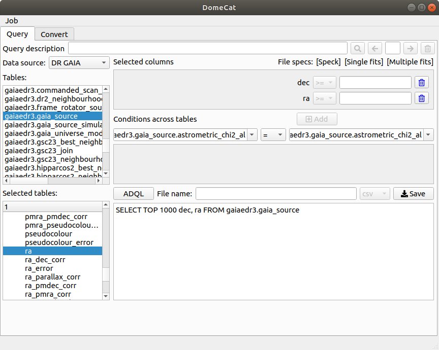

# DomeCat 
## A Tool to Explore Astronomical Databases and Transform Data into Planetarium Formats

The Virtual Observatory provides a valuable source for presentations
in digital planetaria. However, importing data into planetaria can be
a time-consuming process because the data must be selected, downloaded
and transformed into a format used in digital planetaria. The later
step is typically done by means of ad-hoc scripts. DomeCat is a
user-friendly tool that can perform such steps on a single graphical
user interface (GUI). Additionally, includes a database to keep track
of the transformed data and runtime of the procesess.



## Installation

The easiest way to run DomeCat is by downloading an executable file for Ubuntu, Windows or MacOSX. The latest releases can be found [here](https://github.com/Venustiano/DomeCat/releases).

### Compile under Linux and OSX

1. Install [](https://www.python.org/downloads/) if not installed and `venv`
```
apt install python3.9-dev python3.9-venv
```
2. Clone this repository.
```
git clone https://github.com/Venustiano/DomeCat.git
cd ./DomeCat/src
``` 
3. Run

```
source ./domecat-env.sh
```  

This script will create and activate a virtual environment
`env`, install the required packages and run `python domecat.py`

4. If everything went fine, you'll see the GUI.

5. When you are done close the app. Your current directory will be the root of the repository.  

6. Deactivate the environment.
```
deactivate
```
### Building the DomeCat app under Ubuntu and OSX
1. Activate the virtual environment
```
source ./env/bin/activate
```
2. Run the following command
```
pyinstaller --onefile --add-data "./env/lib/python3.9/site-packages/astroquery/CITATION:astroquery/" --add-data "./config/*:config/" ./domecat.py
```
3. Run the app

```
./dist/domecat
```

### Compile under Windows

1. In a powershell window, clone this repository
```
git clone https://github.com/Venustiano/DomeCat.git
cd ./DomeCat/src
```

2. Install [](https://www.python.org/downloads/) if
   necessary and make sure you [add python to the
   `PATH`](https://docs.python.org/3/using/windows.html)

3. Create a virtual environment
```
python -m venv env/
```
4. Activate the virtual environment
```
.\env\Scripts\activate.ps1
```
5. If the above command does not work [run as administrator in a different powershell window](https://stackoverflow.com/questions/4037939/powershell-says-execution-of-scripts-is-disabled-on-this-system)
```
powershell Set-ExecutionPolicy -Scope "CurrentUser" -ExecutionPolicy "RemoteSigned"
```
6. Install the [`sciserver`](https://github.com/sciserver/SciScript-Python) python libraries.
```
cd ./env/
git clone http://github.com/sciserver/SciScript-Python.git
cd SciScript-Python/py3
python setup.py install
cd ..\..\..\
```

9. Install the required packages
```
pip install -r .\requirements.txt
```
10. Run Domecat
```
python .\domecat.py
```

11. After stopping DomeCat, deactivate the environment.

```
deactivate
```

### Building the DomeCat app under Windows
1. Activate the virtual environment
```
.\env\Scripts\activate.ps1
```
2. Run the following command
```
pyinstaller.exe --onefile --add-data "./env/Lib/site-packages/astroquery/CITATION;astroquery/" --add-data "./config/*;config/" ./domecat.py
```
3. Run the app

```
.\dist\domecat.exe
```


## 📚 References

If you use **DomeCat** in your work or research, please cite the following publication:

> V. Soancatl-Aguilar, O.~R. Williams, C. Ji, E.~A. Valentijn, A. Mathlener, and J.~B.~T.~M. Roerdink.  
> **Visualising Virtual Observatory Data in Digital Planetaria.**  
> *Astronomical Society of the Pacific Conference Series*, vol. 522, pp. 229, 2020.  
> In *Astronomical Data Analysis Software and Systems XXIX (ADASS XXIX)*.  
> Editors: R. Pizzo, E.~R. Deul, J.~D. Mol, J. de Plaa, H. Verkouter.  
> Conference held 06–10 October 2019.  
> [ADS Bibcode: 2020ASPC..522..229S](https://ui.adsabs.harvard.edu/abs/2020ASPC..522..229S)

**BibTeX:**
```bibtex
@inproceedings{d4001b8f2f3c453aa1cf5f79ea79f3f0,
  title     = {Visualising Virtual Observatory Data in Digital Planetaria},
  author    = {V. Soancatl-Aguilar and O.~R. Williams and C. Ji and E.~A. Valentijn and A. Mathlener and J.~B.~T.~M. Roerdink},
  year      = {2020},
  month     = jan,
  day       = {1},
  language  = {English},
  series    = {Astronomical Society of the Pacific Conference Series},
  publisher = {Astronomical Society of the Pacific},
  pages     = {229},
  editor    = {R. Pizzo and E.~R. Deul and J.~D. Mol and {de Plaa}, J. and H. Verkouter},
  booktitle = {Astronomical Society of the Pacific Conference Series},
  note      = {Astronomical Data Analysis Software and Systems XXIX : (ADASS XXIX) ; Conference date: 06-10-2019 Through 10-10-2019},
}

## License


[](/LICENSE)

<!-- DomeCat has been developed for two main purposes. First, to provide a -->
<!-- user friendly interface to explore and download data from different -->
<!-- astronomical catalogues. Second, to transform data into planetarium -->
<!-- formats. Currently, GAIA, SDSS and ESO catalogues are -->
<!-- supported. Because of the download limitations of the anonymous user, -->
<!-- authentication credentials are requested for SDSS and -->
<!-- GAIA. Appropriate links to sign up are provided when authentication is -->
<!-- required. -->


<!-- Given the appropriate columns or variables -->
<!-- such as `ra`, `dec`, and `parallax` or `redshift`, these data can be -->
<!-- used to generate file formats such as `speck`, `fits` and -->
<!-- `octrees`. Such file formats can be used for visual exploration of the -->
<!-- data using [OpenSpace](https://www.openspaceproject.com/). This tool -->
<!-- has the following features -->


## Acknowledgements

The development of DomeCat was undertaken as part of the Target Field
Lab, with financial contributions from Samenwerkingsverband Noord
Nederland (SNN), the European Regional Development Fund (ERDF), and
the Dutch Ministry of Economic Affairs and Climate Policy (EZK).


